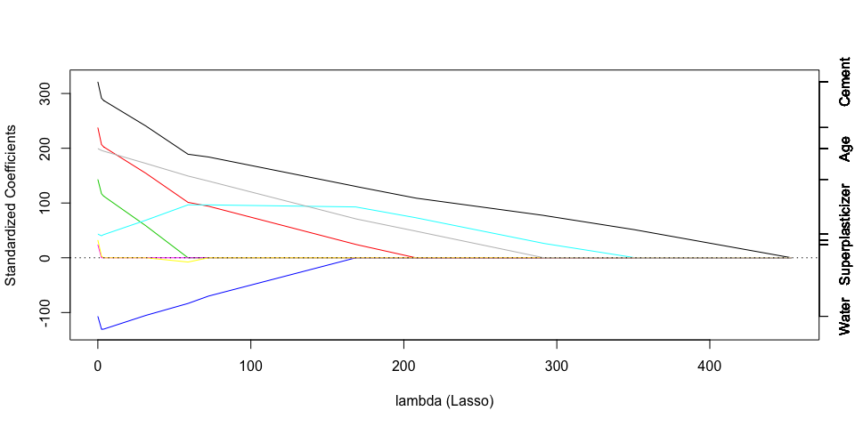

Tom Lous  
15 May 2016  


# Quiz 4
## Question 1

For this quiz we will be using several R packages. R package versions change over time, the right answers have been checked using the following versions of the packages.

* AppliedPredictiveModeling: v1.1.6
* caret: v6.0.47
* ElemStatLearn: v2012.04-0
* pgmm: v1.1
* rpart: v4.1.8
* gbm: v2.1
* lubridate: v1.3.3
* forecast: v5.6
* e1071: v1.6.4

If you aren't using these versions of the packages, your answers may not exactly match the right answer, but hopefully should be close.

Load the vowel.train and vowel.test data sets:


```r
library(ElemStatLearn)
data(vowel.train)
data(vowel.test)
```

Set the variable y to be a factor variable in both the training and test set. Then set the seed to 33833. Fit (1) a random forest predictor relating the factor variable y to the remaining variables and (2) a boosted predictor using the "gbm" method. Fit these both with the train() command in the caret package.

What are the accuracies for the two approaches on the test data set? What is the accuracy among the test set samples where the two methods agree?

### Answer


```r
vowel.train$y <- as.factor(vowel.train$y)
vowel.test$y <- as.factor(vowel.test$y)
set.seed(33833)
modRF <- train(y ~ ., data=vowel.train, method="rf") #, trControl=trainControl("cv"), number=3)
modBoost <- train(y ~ ., data=vowel.train, method="gbm", verbose=FALSE)

predRF <- predict(modRF, vowel.test)
predBoost <- predict(modBoost, vowel.test)
agreedIndex <- predRF == predBoost

cfmRf <- confusionMatrix(vowel.test$y, predRF)
cfmBoost <- confusionMatrix(vowel.test$y, predBoost)
cfmAgreed <- confusionMatrix(vowel.test$y[agreedIndex], predRF[agreedIndex])

cfmRf$overall["Accuracy"]
```

```
##  Accuracy 
## 0.6147186
```

```r
cfmBoost$overall["Accuracy"]
```

```
##  Accuracy 
## 0.5367965
```

```r
cfmAgreed$overall["Accuracy"]
```

```
##  Accuracy 
## 0.6656051
```


------

## Question 2

Load the Alzheimer's data using the following commands


```r
library(gbm)
set.seed(3433)
library(AppliedPredictiveModeling)
data(AlzheimerDisease)
adData = data.frame(diagnosis,predictors)
inTrain = createDataPartition(adData$diagnosis, p = 3/4)[[1]]
training = adData[ inTrain,]
testing = adData[-inTrain,]
```

Set the seed to 62433 and predict diagnosis with all the other variables using a random forest ("rf"), boosted trees ("gbm") and linear discriminant analysis ("lda") model. Stack the predictions together using random forests ("rf"). What is the resulting accuracy on the test set? Is it better or worse than each of the individual predictions?

### Answer


```r
set.seed(62433)
modRF2 <- train(diagnosis ~ ., data=training, method="rf") #, trControl=trainControl("cv"), number=3)
modBoost2 <- train(diagnosis ~ ., data=training, method="gbm", verbose=FALSE)
modLDA2 <- train(diagnosis ~ ., data=training, method="lda", verbose=FALSE)

predRF2 <- predict(modRF2, testing)
predBoost2 <- predict(modBoost2, testing)
predLDA2 <- predict(modLDA2, testing)

dataCombined <- data.frame(predRF2, predBoost2, predLDA2, diagnosis=testing$diagnosis)
modCombined <- train(diagnosis ~ ., data=dataCombined, method="rf", verbose=FALSE)
```

```
## note: only 2 unique complexity parameters in default grid. Truncating the grid to 2 .
```

```r
predCombined <- predict(modCombined, dataCombined)

cfmRF2 <- confusionMatrix(testing$diagnosis, predRF2)
cfmBoost2 <- confusionMatrix(testing$diagnosis, predBoost2)
cfmLDA2 <- confusionMatrix(testing$diagnosis, predLDA2)
cfmCombined <- confusionMatrix(testing$diagnosis, predCombined)


cfmRF2$overall["Accuracy"]
```

```
##  Accuracy 
## 0.7682927
```

```r
cfmBoost2$overall["Accuracy"]
```

```
##  Accuracy 
## 0.7926829
```

```r
cfmLDA2$overall["Accuracy"]
```

```
##  Accuracy 
## 0.7682927
```

```r
cfmCombined$overall["Accuracy"]
```

```
## Accuracy 
## 0.804878
```


------
## Question 3

Load the concrete data with the commands:


```r
set.seed(3523)
library(AppliedPredictiveModeling)
data(concrete)
inTrain = createDataPartition(concrete$CompressiveStrength, p = 3/4)[[1]]
training = concrete[ inTrain,]
testing = concrete[-inTrain,]
```

Set the seed to 233 and fit a lasso model to predict Compressive Strength. Which variable is the last coefficient to be set to zero as the penalty increases? (Hint: it may be useful to look up ?plot.enet).

### Answer


```r
set.seed(233)
modLasso <- train(CompressiveStrength ~ ., data=training, method="lasso")
plot.enet(modLasso$finalModel,  xvar="penalty", use.color=TRUE)
```




------
## Question 4

Load the data on the number of visitors to the instructors blog from here:

<https://d396qusza40orc.cloudfront.net/predmachlearn/gaData.csv>


```r
library(lubridate) # For year() function below
dat = read.csv("gaData.csv")
training = dat[year(dat$date) < 2012,]
testing = dat[(year(dat$date)) > 2011,]
tstrain = ts(training$visitsTumblr)
```

Fit a model using the bats() function in the forecast package to the training time series. Then forecast this model for the remaining time points. For how many of the testing points is the true value within the 95% prediction interval bounds?


### Answer


```r
modBats <- bats(tstrain)
forecastObj <- forecast(modBats, level=95, h=nrow(testing))
betweenVal <- sum(testing$visitsTumblr > forecastObj$lower &  testing$visitsTumblr < forecastObj$upper)
betweenVal / nrow(testing) * 100
```

```
## [1] 96.17021
```

------

## Question 5

Load the concrete data with the commands:


```r
set.seed(3523)
library(AppliedPredictiveModeling)
data(concrete)
inTrain = createDataPartition(concrete$CompressiveStrength, p = 3/4)[[1]]
training = concrete[ inTrain,]
testing = concrete[-inTrain,]
```

Set the seed to 325 and 􀃒t a support vector machine using the e1071 package to predict Compressive Strength using
the default settings. Predict on the testing set. What is the RMSE?

### Answer


```r
set.seed(325)
modSvm <- svm(CompressiveStrength ~ ., data = training)
predSvm <- predict(modSvm, testing)
accSvm <- accuracy(predSvm, testing$CompressiveStrength)
data.frame(accSvm)["RMSE"]
```

```
##              RMSE
## Test set 6.715009
```


